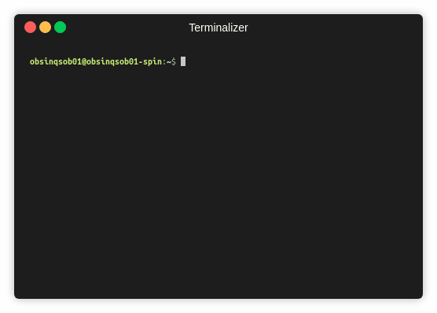

# TerminalAndCmd
Practicas para usar la terminal en linux

## Guia de archivos :newspaper:
```
TerminalAndCmd
│   README.md
|
│   PRACTICAS.md # Contiene una lista de los comandos que deberás de utilizar para realizar los ejercicios
|   EJERCICIOS.md # Contiene la lista de ejercicios que deberás de resolver
```
